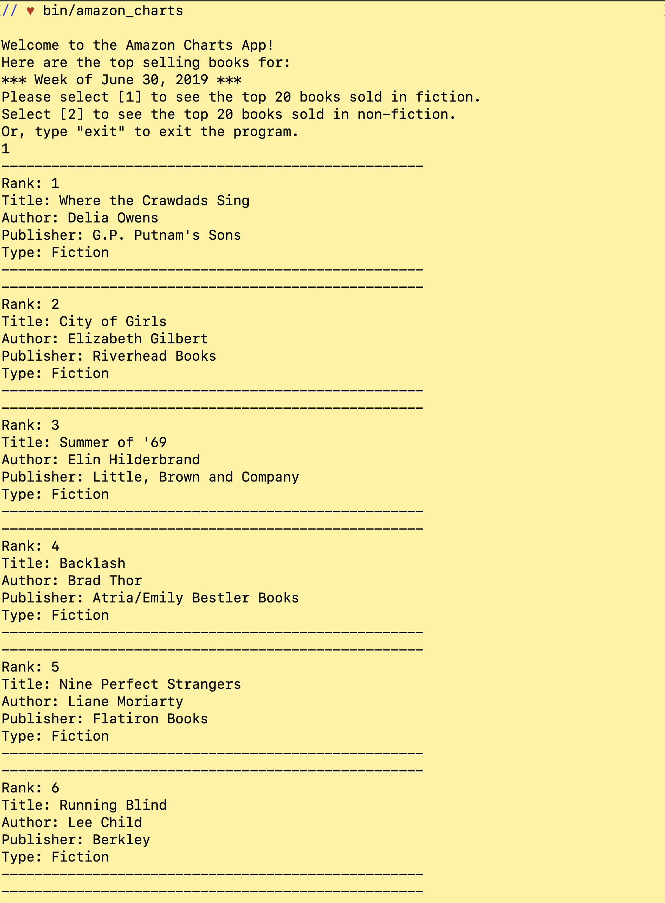
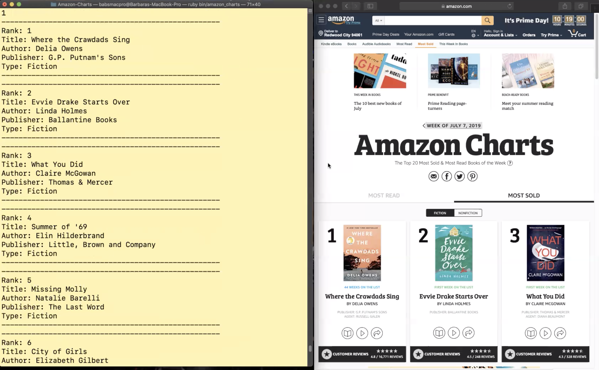

## Amazon Charts

Welcome to Amazon Charts, a Ruby CLI app that displays a list of the top 20 selling books in Fiction and Non-Fiction, for the <i>current</i> week.  

Data scraped using Nokogiri from: https://www.amazon.com/charts

 

## Installation

Clone or Download:

    git@github.com:SilverBright/Amazon-Charts.git

Run `bundle`.

Run `bin/setup` to install dependencies.

Then, run `bin/amazon_charts` to start the app.

## Instructions

Press [1] to see a list of the top 20 books sold in fiction.  
Press [2] to see a list of the top 20 books sold in non-fiction.  
Type "exit" to exit the program.

Note: Pressing any other key will display an error message and prompt the user to make a correct entry.

Users will see a list of the following attributes, for each book:

- Ranking (in order of #1 to #20)
- Title
- Author
- Publisher
- Type (Fiction or Non-Fiction)

## Contributing

Bug reports and pull requests are welcome on GitHub. This project is intended to be a safe, welcoming space for collaboration, and contributors are expected to adhere to the Contributor Covenant code of conduct.

## License

The application is available as open source under the terms of the [MIT License](https://github.com/SilverBright/Amazon-Charts/blob/master/LICENSE.txt).